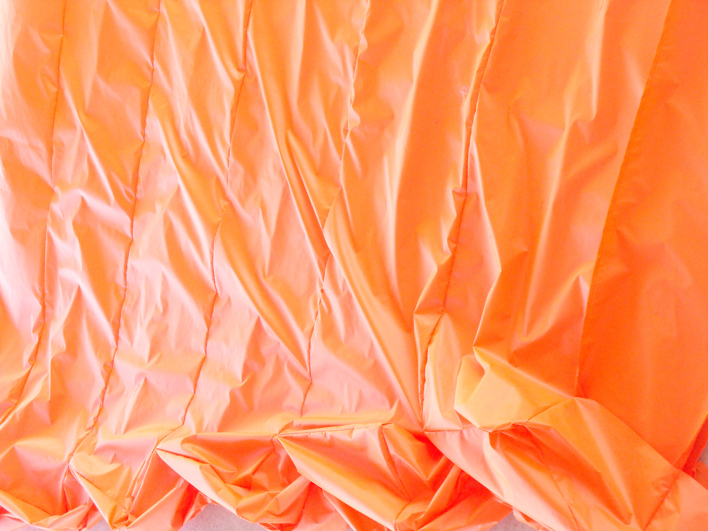

Please arrive by 7:45pm.  Panel starts at 8pm sharp.

## 8pm- Welcome and introductions

I’ll ask each of you to introduce yourselves.  30 seconds or less each.

## 8:02 - Art and AI 

(5 questions approx 3 minutes per question)

1. Who owns the art etc generated by AIs and why?

   - "It’s also odd to some lawyers that generative AI firms are being sued and not those that compiled the dataset. In the case of Midjourney, that would be the large-scale Artificial Intelligence Open Network (LAION), based in Germany. “If LAION created the dataset, then the alleged infringement occurred at that point, not once the dataset was used to train the models,” Eliana Torres, an intellectual property lawyer with the law firm Nixon Peabody, told [_Tech Crunch_](https://techcrunch.com/2023/01/27/the-current-legal-cases-against-generative-ai-are-just-the-beginning/) last month." https://techmonitor.ai/technology/ai-and-automation/will-2023-be-year-of-ai-lawsuit

2. **What is borrowing/what is copying?**

   - My work is [in the LAION dataset](https://rom1504.github.io/clip-retrieval/?back=https%3A%2F%2Fknn.laion.ai&index=laion5B-H-14&useMclip=false&query=orange+inflatable+sculpture+japan) If "orange inflatable sculpture japan" is searched, my work is first hit with aesthetic score of 7 and fill 4 of the top 10 results and many more
   - Invisible bicycle and many other works are in the dataset
   - With prompt fiddling I can get works that are close to mine from the generators but I do not have enough images online to make a full duplicate, but definitely see parts
   - 
   - 
   - [LAION search result with multiple images of mine and my name](https://rom1504.github.io/clip-retrieval/?back=https%3A%2F%2Fknn.laion.ai&index=laion5B-H-14&useMclip=false&imageUrl=https%3A%2F%2Fwww.jimmykuehnle.com%2Fexhib%2Faichi_geidai%2FJimmy_Kuehnle_Big_Blob_inflatable_suit_viewer_participation_418.jpg)
   - https://fairuse.stanford.edu/overview/fair-use/what-is-fair-use/
   - The idea cannot be copyrighted but the expression of the idea can. If AI uses too many parts of other artists' or writers' specific expression of ideas, then it would fall more into copying than borrowing.
   - [Article from Peta Pixel](https://petapixel.com/2023/02/02/ai-image-generators-can-exactly-replicate-copyrighted-photos/) that shows how some images are retained in the diffusion models
   - Generated Image below

3. **What are the limitations of AI?**

   - currently a slight learning curve
   - big compute needed to make new models
   - AI doesn't have knowledge yet
   - Images relatively low resolution

4. **How long will these limitations exist?**

   - Not that long, the year over year, and even month over month improvements are staggering.
   - Google's new Muse AI image generator just sped up its text to image generation by a factor of 10, now takes about a second an image, eventually will be faster than realtime - https://youtu.be/2AsoWS2t484 from Two Minute Papers
   - Google and Facebook already have video generators that are currently crude but that won't last for long - https://youtu.be/uzF6CTtjn-g from Two Minute Papers

5. What about the AI Lawsuits?
   - The abstracts of the lawsuits seem to misunderstand the technology and therefore may not succeed.
   - Jurors may rule against the generators anyway.

## ~8:25:- AI and Bias

(2 questions- approximately 3 minutes per question)

6. Can we eliminate bias in AI?

7. Given that fairness is subjective (even mathematically), how do we decide what is fair and unbiased?

## ~8:31 - AI and Manipulation

(3 Questions-approximately 3 minutes per question)

8. **How effective is AI at manipulation (politics etc)?**

   - [The People Onscreen Are Fake. The Disinformation Is Real.](https://www.nytimes.com/2023/02/07/technology/artificial-intelligence-training-deepfake.html) - New York Times article about state actors creating deepfakes to spread misinformation
   - Tom Cruise example - needed a body double and voice actor but now could be more easily done

9. **Who should be held responsible?** - The software is already available and open source, ultimately the actors are responsible. For state actors sanctions and diplomacy and deterrence will likely be the unfortunate solution as with nuclear weapons.

10. **Can we identify manipulative AI (deepfakes etc)?** - for now yes. It will not be long until the detection takes much longer than a campaign cycle. Eventually it will likely be almost undetectable without massive compute power.

~8:40 - Questions from Audience

~9:15 — What is the future of AI and Ethics?

(Approximately 5 minutes)

~ 9:20 I’ll ask each of you to give a short closing remark (30 seconds). Then I’ll give a session closing remark, thank the audience and staff

9:30 we are done!

I’ll leave you with this article on AI Lawsuits

- Stable Diffusion Getty [Lawsuit Filing](attachments/1-1-stable-diffusion-complaint.pdf)
  - "Stability downloaded or otherwise acquired copies of billions of copyrighted images without permission to create Stable Diffusion," - This could easily be circumvented by having the AI look as a screen of images via a camera without ever copying the images.
  - "Ultimately, it is merely a complex collage tool." - Collage can already be protected by fair use.
  - "By training Stable Diffusion on the Training Images, Stability caused those images to be stored at and incorporated into Stable Diffusion as compressed copies. Stability made them without the consent of the artists and without compensating any of those artists." - Misunderstanding of the diffusion process and compression
  - "All AI Image Products operate in substantially the same way and store and incorporate countless copyrighted images as Training Images." - They are not copying the images or storing them.
  - The best argument is the financial harm to the artist when typing a name in gets a style. This could be avoided by removing names from the training set or prompts.
  - The lawsuits are going to have a tough hill to climb and then they will have to litigate the next technology
  - "The resulting image is necessarily a derivative work, because it is generated exclusively from a combination of the conditioning data and the latent images, all of which are copies of copyrighted images. It is, in short, a 21st-century collage tool." p20 again - not all the images in the training are copyrighted so this is going to be a hard line of argument
- https://techmonitor.ai/technology/ai-and-automation/will-2023-be-year-of-ai-lawsuit

original
prompt file name inflatable_orange_fin_for_suit.jpg

Prompt - inflatable_orange_fin_for_suit aichii japan sculpture rugakusei

